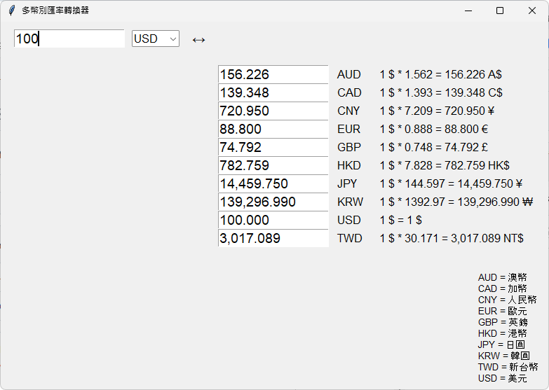

# currency-converter-v3

本專案（currency-converter-v3）是一個以 Python tkinter 製作的多幣別匯率轉換器，支援即時查詢多種貨幣（包含港幣）之間的匯率，並可雙向換算。

## 功能特色
- 支援多種主要貨幣：美元、港幣、台幣、人民幣、日圓、歐元、英鎊、澳幣、加幣、韓圓
- 即時查詢匯率，自動更新
- 支援雙向換算（A→B、B→A）
- 介面簡潔，操作直覺

## 預覽畫面 | Screenshot

  
_▲ 程式主畫面：可產生相對應匯率_

## 安裝方式
1. 安裝 Python 3.7 以上版本
2. 安裝必要套件：
   ```bash
   pip install requests
   ```
3. 下載 `currency_converter_v3.py` 檔案

## 使用說明
1. 執行 `currency_converter_v3.py`
2. 輸入金額，選擇來源幣別，即可自動換算所有目標幣別
3. 亦可在目標幣別欄位輸入金額，反向換算來源幣別

## 幣別對照
- AUD = 澳幣
- CAD = 加幣
- CNY = 人民幣
- EUR = 歐元
- GBP = 英鎊
- HKD = 港幣
- JPY = 日圓
- KRW = 韓圓
- TWD = 新台幣
- USD = 美元

## 注意事項
- 匯率資料來源為 Google Finance，若查詢失敗請檢查網路連線
- 僅供參考，實際匯率以銀行公告為準

## 授權
本專案採用 MIT License 授權 
